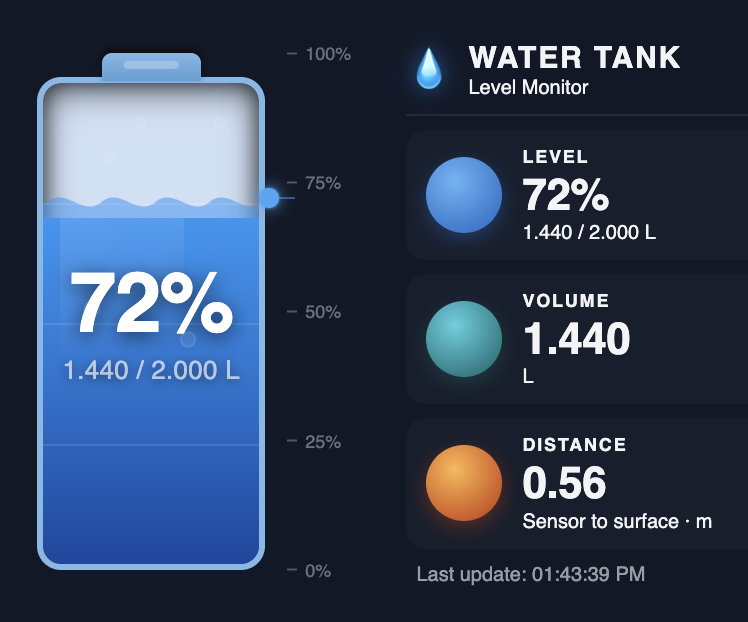

# Water Tank Card

A custom [Home Assistant](https://www.home-assistant.io/) Lovelace card that displays water tank status as an animated visual dashboard. Shows fill level, volume, and sensor-to-surface distance in a single card.




---

## Features

- Animated tank that fills and drains with the real water level
- Color-coded fill: blue (>30%), orange (15–30%), red (≤15%)
- Animated wave surface and rising bubbles
- Level percentage and current volume overlaid on the tank
- Three stat panels: **Level**, **Volume**, and **Distance** (sensor to water surface)
- Last-updated timestamp in the footer
- Adapts to Home Assistant light and dark themes
- Compatible with the HA **Sections** grid layout
- Supports **English** and **Danish** (follows the HA language setting)

---

## Requirements

The card expects three sensor entities:

| Entity | Unit | Description |
|---|---|---|
| Level | `%` | Water level as a percentage of tank capacity |
| Volume | `L` | Current water volume |
| Distance | `m` | Distance from the ultrasonic sensor to the water surface |

These map naturally to devices running [ESPHome](https://esphome.io/) with an ultrasonic sensor, but any sensor entities with the correct units will work.

---

## Installation

### Via HACS (recommended)

1. Open **HACS** in Home Assistant.
2. Go to **Frontend** → click the three-dot menu → **Custom repositories**.
3. Add `https://github.com/briis/ha-watertankcard` with category **Lovelace**.
4. Find **Water Tank Card** in the list and click **Download**.
5. Reload your browser.

### Manual

1. Download `water-tank-card.js` from the [latest release](https://github.com/briis/ha-watertankcard/releases/latest).
2. Copy it to `/config/www/ha-watertankcard/water-tank-card.js`.
3. In Home Assistant go to **Settings → Dashboards → Resources** and add:
   ```
   URL:  /local/ha-watertankcard/water-tank-card.js
   Type: JavaScript module
   ```
4. Reload your browser.

---

## Configuration

Add the card to a dashboard via the UI card picker (**Water Tank Card**) or paste the YAML directly.

### Options

| Option | Type | Required | Default | Description |
|---|---|---|---|---|
| `type` | string | yes | — | `custom:water-tank-card` |
| `entity_level` | string | yes | `sensor.water_tank_monitor_water_tank_level` | Entity ID for tank level (%) |
| `entity_volume` | string | yes | `sensor.water_tank_monitor_water_tank_volume` | Entity ID for water volume (L) |
| `entity_distance` | string | yes | `sensor.water_tank_monitor_water_tank_distance` | Entity ID for sensor-to-surface distance (m) |
| `tank_capacity` | number | no | `null` | Total tank capacity in litres — shows "current / max L" when set |
| `title` | string | no | `Water Tank` | Custom card title |

### Example

```yaml
type: custom:water-tank-card
entity_level: sensor.water_tank_level
entity_volume: sensor.water_tank_volume
entity_distance: sensor.water_tank_distance
tank_capacity: 2000
title: Garden Tank
```

---

## Grid layout

The card declares its preferred grid size for the HA Sections layout:

| Property | Value |
|---|---|
| Default columns | 4 |
| Minimum | 2 × 2 |
| Maximum columns | 6 |

---

## License

[MIT](LICENSE)
